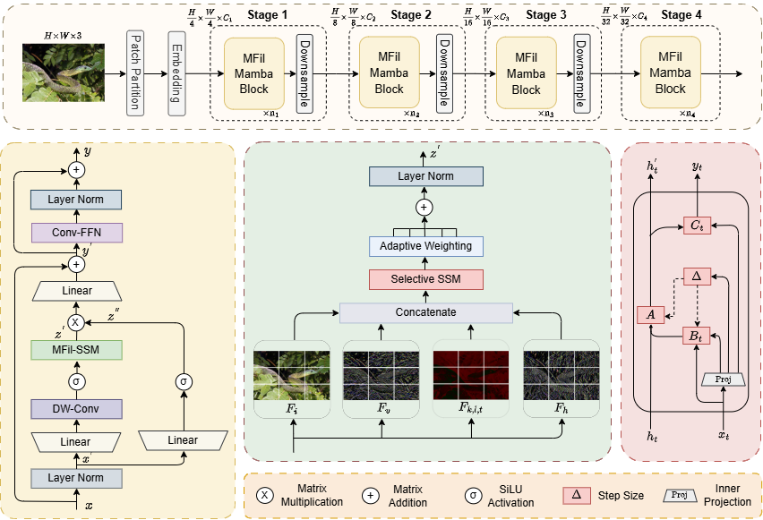

<div align="left">
  
# MFil-Mamba: Multi-Filter Scanning for Spatial Redundancy-Aware Visual State Space Models


Official pytorch implementation of MFil-Mamba.

## Abstract

State Space Models (SSMs), especially recent Mamba architecture, have achieved remarkable success in sequence modeling tasks. However, extending SSMs to computer vision remains challenging due to the non-sequential structure of visual data and its complex 2D spatial dependencies. Although several early studies have explored adapting selective SSMs for vision applications, most approaches primarily depend on employing various traversal strategies over the same input. This introduces redundancy and distorts the intricate spatial relationships within images. To address these challenges, we propose MFil-Mamba, a novel visual state space architecture built on a multi-filter scanning backbone. Unlike fixed multi-directional traversal methods, our design enables each scan to capture unique and contextually relevant spatial information while minimizing redundancy. Furthermore, we incorporate an adaptive weighting mechanism to effectively fuse outputs from multiple scans in addition to architectural enhancements. MFil-Mamba achieves superior performance over existing state-of-the-art models across various benchmarks that include image classification, object detection, instance segmentation, and semantic segmentation. For example, our tiny variant attains 83.2% top-1 accuracy on ImageNet-1K, 47.3% box AP and 42.7% mask AP on MS COCO, and 48.5% mIoU on the ADE20K dataset. 


<p align="center">
  
</p>

## Results
### **Classification on ImageNet-1K**
| Name | Pretrain | Resolution | #Params | FLOPs | Acc@1 | Models |
| :---: | :---: | :---: | :---: | :---: | :---: | :---: 
| MFil-Mamba-Tiny  | ImageNet-1K | 224x224  | 33.5M | 5.6G  | 83.2  |  [ckpt](https://drive.google.com/file/d/1ZS8GFMNswnZRuiZiW7Cclps4vYGHCMww/view?usp=drive_link) |
| MFil-Mamba-Small  | ImageNet-1K | 224x224  | 50.6M | 9.1G  |  83.9 |  [ckpt](https://drive.google.com/file/d/1wGZ0N1V_cUnNZUPGqbt2KrEVv8fg3N4C/view?usp=sharing) |
| MFil-Mamba-Base  | ImageNet-1K | 224x224  | 93.1M | 16.8G | 84.2  |  [ckpt](https://drive.google.com/file/d/1JNcW009B-VzFrdT_Q0EIdTy6Xl0Lu6Lc/view?usp=sharing)  |


## Usage

### Installation

Clone the MFil-Mamba Github repo:
```bash
git clone https://github.com/puskal-khadka/MFil-Mamba
cd MFil-Mamba
```

Setup Environment
```bash
conda create -n mfilmamba python=3.11
conda activate mfilmamba
```

Install dependencies
```
pip install -r requirements.txt
pip install kernels/.
```

### Dataset Preparation
We use the ImageNet-1k dataset and organize the downloaded files in the following directory structure:
  ```bash
  imagenet1k
  ├── train
  │   ├── class1
  │   │   ├── img1.jpeg
  │   │   └── ...
  │   ├── class2
  │   │   ├── img2.jpeg
  │   │   └── ...
  │   └── ...
  └── val
      ├── class1
      │   ├── img3.jpeg
      │   └── ...
      ├── class2
      │   ├── img4.jpeg
      │   └── ...
      └── ...
 
  ```

### Training
To train MFil-Mamba for ImageNet-1k classification task:
```bash
  bash dist_train.sh <model_variant> <total_gpus> /path/to/output --data-path /path/to/imagenet --input-size 224 --batch-size <batch_per_gpu> --epochs 300
```
<model_variant> is the name of model variant, i.e, mfil_tiny, mfil_small or mfil_base


### Evaluation
To evaluate a pre-trained model on ImageNet-1k val:
``` bash
bash dist_train.sh <model_variant> 1 /path/to/output --resume /path/to/checkpoint_file --data-path /path/to/imagenet --input-size 224 --eval
```

## Acknowledgment
Our codeis based on [Mamba](https://github.com/state-spaces/mamba), [VMamba](https://github.com/MzeroMiko/VMamba/tree/main) and [OpenMMLab](https://github.com/open-mmlab). Thanks for their amazing works.

